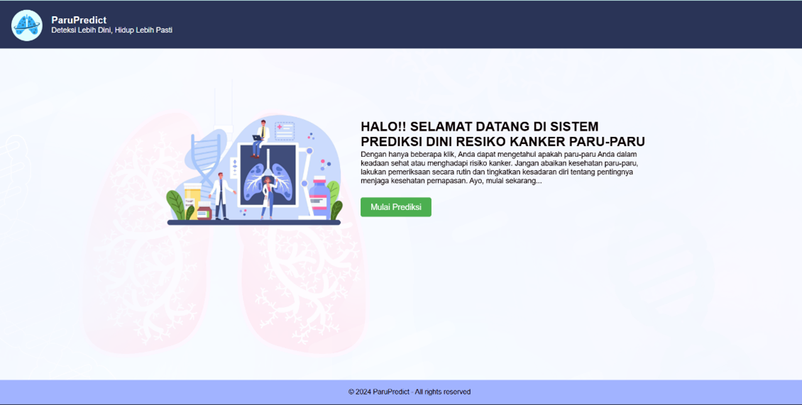
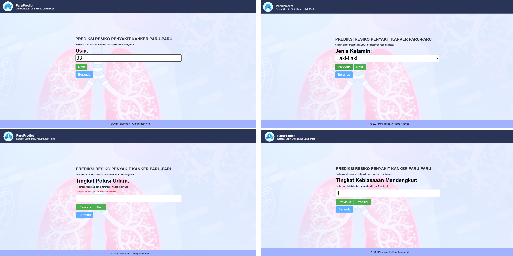
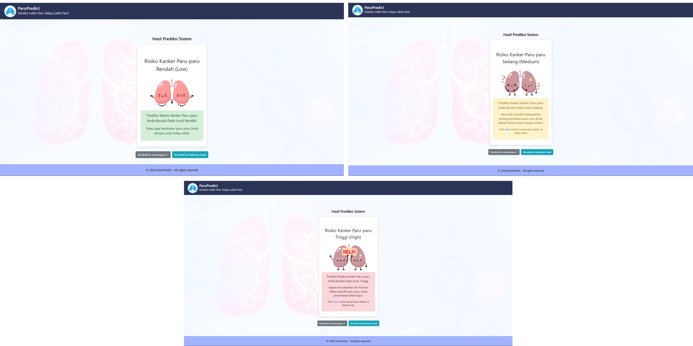

# Sistem Prediksi Risiko Kanker Paru-Paru

Sistem ini menggunakan model algoritma Artificial Neural Network (ANN) berbasis web Flask ini memprediksi tingkat risiko kanker paru-paru dengan output berupa kategori Low, Medium, atau High. Sistem menganalisis data seperti usia, riwayat merokok, dan faktor resiko lainnya.

## Screenshots

## Halaman Utama



| Halaman Input                            | Halaman Hasil Prediksi                                       |
| ---------------------------------------- | ------------------------------------------------------------ |
|  |  |

## Usage

1. Clone this repository to your local machine.
2. Install the required dependencies:

```
pip install pandas matplotlib Flask scikit-learn keras
```

3. Train the model by running:

```
python predict_model_ann.ipynb
```

4. Start the Flask web application with:

```
python app.py
```

7. Access the application through your web browser at http://localhost:5000.
8. Fill in the form with the required information.
9. Click the "Prediksi" button to get the predicted outcome.

## Lisensi

Proyek ini dilisensikan di bawah [MIT License](LICENSE).
